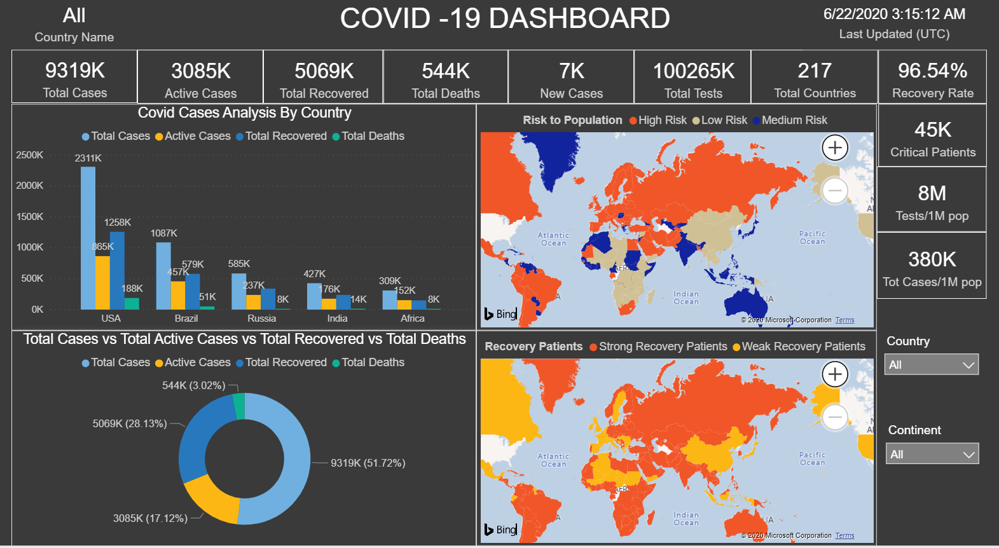

# Covid-19-Realtime-Dashboard

* This is a Live Dashboard built by Microsoft Power BI for analyzing the real-time COVID-19 pandemic effect worldwide.
* This project demonstrates Power BI visuals for visualizing Coronavirus impact worldwide using various visuals such as a filled map, Clustered column chart, Donut chart, Card visuals, Slicers etc
* For this project, I scrapped the real time  data from the website https://www.worldometers.info/coronavirus/ and imported the data into Power BI desktop using "Web"  as data source.
* Covid-19 Real Time Dashboard is hosted on https://app.powerbi.com/view?r=eyJrIjoiZmZjMGNiMGMtZTg3YS00NDZmLWE4NTAtZjZmYTgzMWVlOTE5IiwidCI6ImEwODM3YzBlLWY1MmUtNDhmMy04MjdlLWEzOTNkM2Y3ZGViNyJ9

# Dashboard Demo
* Covid-19 Dashboard Main Page

* Covid-19 cases Analysis by Country using Clustered column chart

* Total cases vs Total Active cases vs Total Recovered vs Total Deaths using Donut chart

* Risk to Population by country using Filled Map

* Recovered Patients by country using Filled Map

* Covid-19 cases comparision between USA and INDIA

 ### Dashboard created by : Chaithanya Vamshi
 ### Dashboard Link :  https://app.powerbi.com/view?r=eyJrIjoiZmZjMGNiMGMtZTg3YS00NDZmLWE4NTAtZjZmYTgzMWVlOTE5IiwidCI6ImEwODM3YzBlLWY1MmUtNDhmMy04MjdlLWEzOTNkM2Y3ZGViNyJ9
